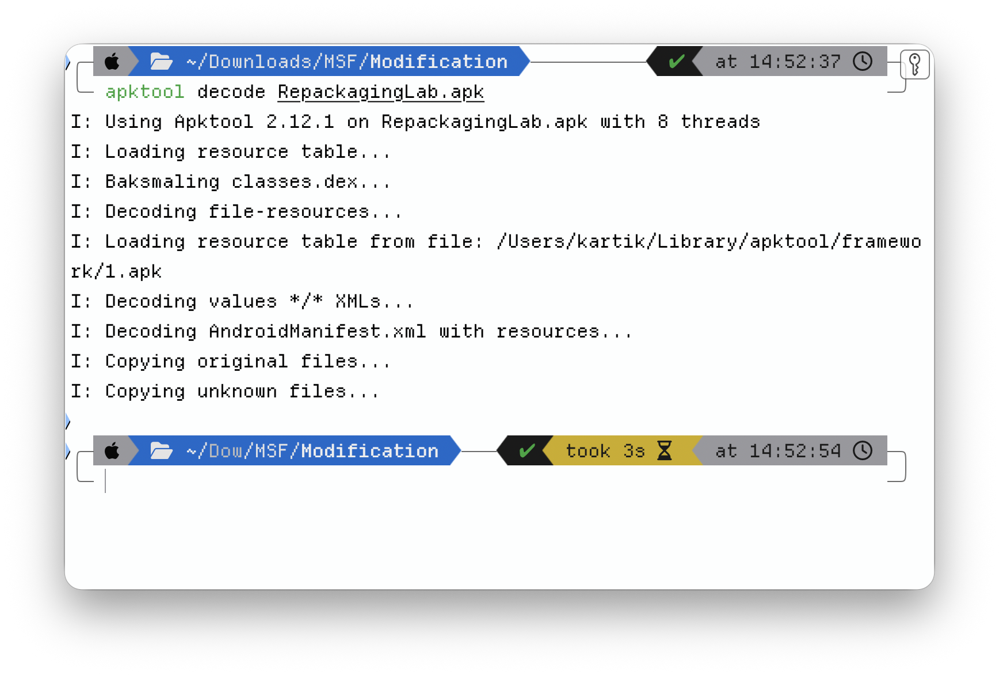
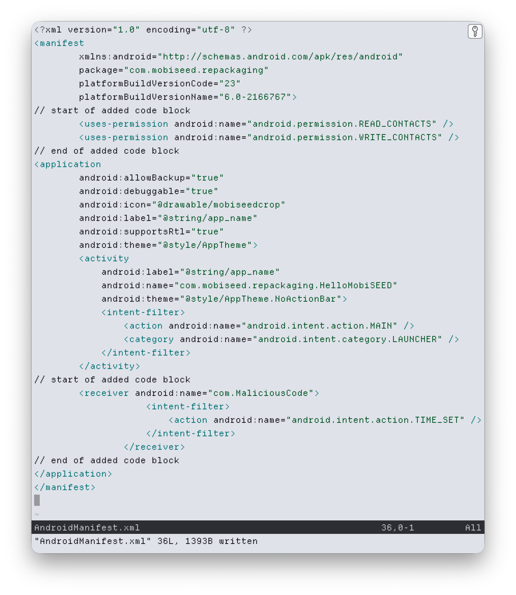
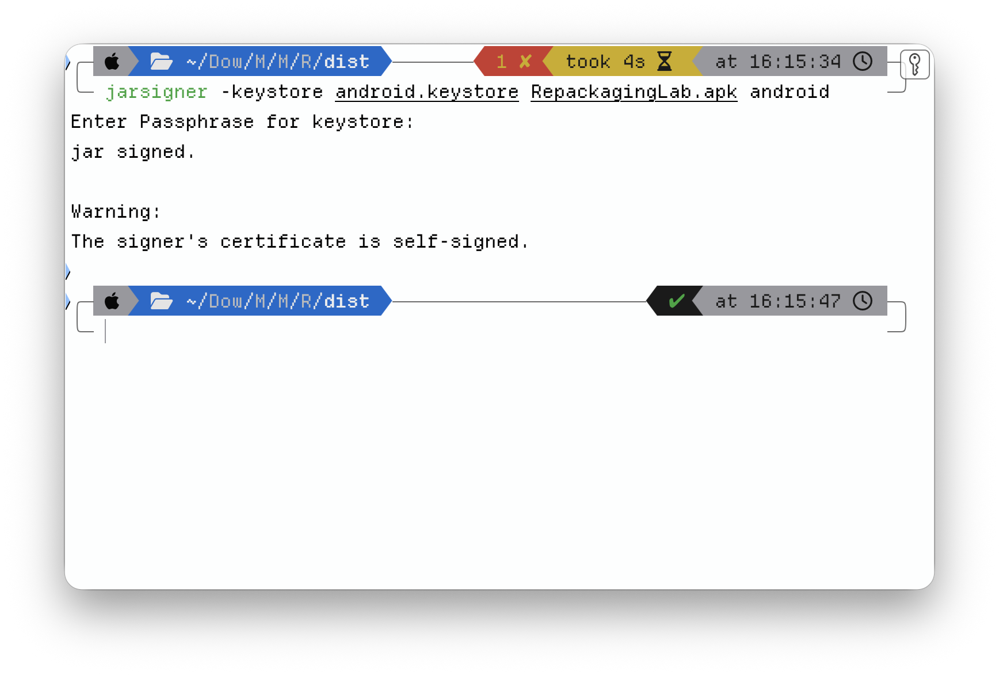
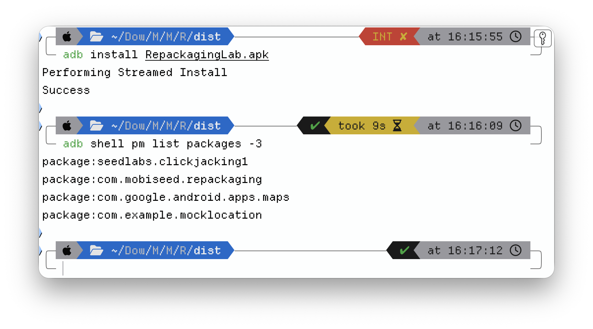
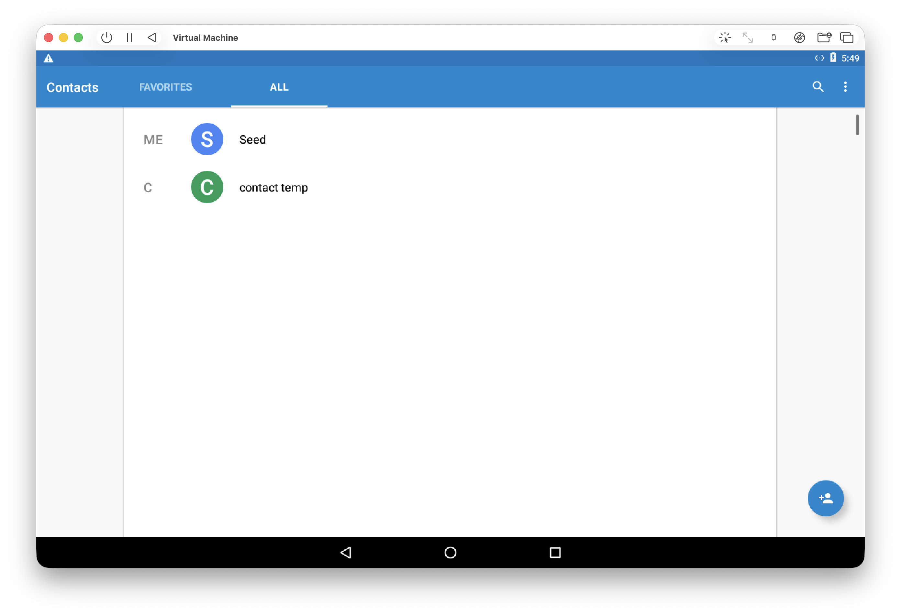

One of my Mobile Security & Forensics labs at NFSU was a *repackaging attack*: take a real, signed Android app, pull it apart, slip in a malicious payload, put it back together, and re-sign it so the phone installs it without a second thought. In my run the finished app looked and behaved exactly like the original — until the device clock changed, at which point it silently deleted every contact on the phone.

The attack is the point of the lab. But the SEED-Labs manual assumes one very specific, decade-old setup: Ubuntu 16.04 in VirtualBox, an old `apktool`, and an Android image that "just boots." I did it on an Apple-Silicon Mac instead. The attack itself worked unchanged. The *environment* fought me four separate times, in ways the manual never mentions — and those four fights are the part of this worth writing down.

## What "repackaging" means — and why it works at all

Android doesn't decide whether to trust an app by checking *who* wrote it. It checks that the app is **internally signed by some valid key** and that the signature matches the contents. It does not care that the key is the original developer's.

That's the whole opening. Anyone holding the APK can decompile it, change whatever they like, sign it with *their own* freshly generated key, and the OS will happily install it as a valid, self-consistent app. Same icon, same name, same behaviour on the surface. You never had to write malware from scratch — you weaponised an app the user already trusts. The target here was a deliberately-built lab app, `com.mobiseed.repackaging`.

## Step 1 — Take it apart

```bash
apktool decode RepackagingLab.apk
```

`apktool` unpacks the APK into two things that matter: the `AndroidManifest.xml`, and a tree of **Smali** — the human-readable form of the compiled Dalvik bytecode. You don't need the original Java source; Smali is editable on its own.



## Step 2 — Inject the payload

The payload is a single Smali class, `MaliciousCode.smali`, dropped into the decompiled tree under `smali/com/`. Its logic is small and nasty: query the Android **Contacts Provider** and delete every entry in a loop.

What it is *not* is something you trigger by opening the app — that would be obvious. The interesting design choice is the trigger, and that lives in the manifest.

## Step 3 — Rewrite the manifest (the real attack surface)

Two edits to `AndroidManifest.xml` turn a benign app malicious:

1. Add the permissions the payload needs — `READ_CONTACTS` and `WRITE_CONTACTS`.
2. Register a **broadcast receiver** for `android.intent.action.TIME_SET`, pointed at the malicious class.



That second edit is the clever, ugly bit. `TIME_SET` is a system broadcast that fires whenever the clock changes — automatic network time, a timezone shift, a manual adjustment. By binding the payload to it, the attack needs no icon tap, no foreground activity, no user interaction at all. The malicious capability is declared right next to the legitimate ones, and the trigger is ambient.

## Step 4 — Put it back together and sign it

```bash
apktool build RepackagingLab_Modified
```

Android won't install an unsigned APK, so the rebuilt app has to be signed. I generated a throwaway keystore and signed with it:

```bash
keytool -alias android -genkey -v -keystore android.keystore \
        -keyalg RSA -keysize 2048 -validity 10000
jarsigner -keystore android.keystore RepackagingLab.apk android
```



Note what just happened: the app is now signed with **my** key, not the developer's. To the installer that is a perfectly valid signature — there is nothing structurally wrong with the APK. The only evidence of tampering is that the signing certificate changed, and nobody compares certificates on an app they sideloaded. That mismatch is the entire tell, and it's the one nobody looks at.

## Step 5 — Deploy and detonate

Install to the emulator over ADB, populate some dummy contacts, launch the app once (a freshly-installed Android app sits in a "stopped" state and won't receive broadcasts until first opened), and grant it the contact permissions.





Then the trigger: change the system clock. `TIME_SET` fires, the receiver wakes the payload, and the contact list empties out — no prompt, no UI, nothing the user would notice until they went looking for a number that was no longer there.


## The parts the Ubuntu guides skip

Everything above works on the manual's blessed Ubuntu VM. Here's what doing it on current tools — Apple Silicon, a modern JDK, today's `apktool` — actually cost, and why each one is worth knowing.

**1. `jarsigner` needs a real JDK, and the manual never says so.** On the prescribed Ubuntu image Java is pre-installed, so the lab just runs `jarsigner` and moves on. On a clean Mac it fails immediately — `jarsigner` and `keytool` aren't standalone binaries, they ship inside the JDK. Installing OpenJDK (via Homebrew) and setting `JAVA_HOME` is a hard prerequisite that's completely invisible until you step outside the curated VM.

**2. UTM boots Android into an EFI shell instead of Android.** The SEED Android 7.1 `.vmdk` uses a legacy BIOS / MBR bootloader. UTM's x86_64 template defaults to **UEFI**, so the VM came up in an EFI shell rather than booting the OS. The fix is one toggle — disable "UEFI Boot" in the QEMU settings — but you only find it if you understand *why* the image won't boot. (Worth saying plainly: x86_64 Android on an ARM64 host is full emulation, not virtualization. It's slow. It still works.)

**3. `apktool` threw an "unbound prefix" error on rebuild.** My first build failed on the manifest — an `unbound prefix` XML error on `android:name`. Hand-editing the manifest, I'd dropped the `xmlns:android` namespace declaration and placed the `<uses-permission>` tags outside the manifest block. Manifest XML is unforgiving about namespaces and element hierarchy; fixing the structure fixed the build.

**4. Android 6+ runtime permissions silently revoked themselves.** In final testing the payload didn't wipe contacts — it crashed with a `SecurityException`. The cause: I'd uninstalled the previous version before pushing the new one, and a clean install on Android 6.0+ starts with runtime permissions *revoked*, regardless of what the manifest declares. The app had to be opened and the Contacts permission toggled on by hand before the payload could run. A small, real-world mercy of the modern permission model: on an up-to-date device this attack isn't perfectly silent.

The through-line is simple. The toolchain has moved years past the lab manual, and the manual's "just use this exact old VM" approach quietly papers over every one of these. Doing it on current tools is more friction, but the friction is the education — each failure forced me to understand why a step exists instead of copying it.

## What this looks like from the defender's side

Repackaging is loud, *if* you know where to look — and the same skills that build the attack read it:

- **The certificate changed.** The repackaged app is signed with an attacker key, not the developer's. Signature verification and Google Play Protect exist precisely to catch this; sideloading an APK from outside the store throws that check away. The single most effective defence is "don't install APKs from untrusted sources," and it's effective because it preserves the signature chain.
- **The permission set grew.** An app that suddenly asks for `READ_CONTACTS` / `WRITE_CONTACTS` with no feature that needs them is a red flag a reviewer — or a static analyser — catches by reading the manifest.
- **There's an unexplained receiver.** A broadcast receiver wired to `TIME_SET` with no legitimate purpose is exactly the kind of artefact mobile-malware triage flags.

Decompile, diff the manifest, check who signed it: that's the analyst's loop, and it's the attacker's loop run backwards. I find that the most useful way to learn a defence — you understand why signature verification matters only after you've spent an afternoon defeating it.

## Takeaways

- Android trusts a *valid* signature, not a *trustworthy author*. Re-signing with your own key is the whole attack; the certificate mismatch is the only forensic tell, and it's the one nobody checks on a sideloaded app.
- The dangerous capability hides in the manifest — escalated permissions plus a system-event receiver — not in a flashy payload. Binding to `TIME_SET` makes it fire with zero user interaction.
- Tutorials that pin you to a legacy VM hide the real dependencies. Reproducing the attack on current tools (Apple Silicon, modern JDK and `apktool`) is harder, and that's exactly why it teaches more.

*Tooling: `apktool` 2.12, OpenJDK 25 (`keytool` / `jarsigner`), Android platform-tools (`adb`), UTM/QEMU. Target: the SEED-Labs MobiSEED repackaging app, run on macOS / ARM64.*
