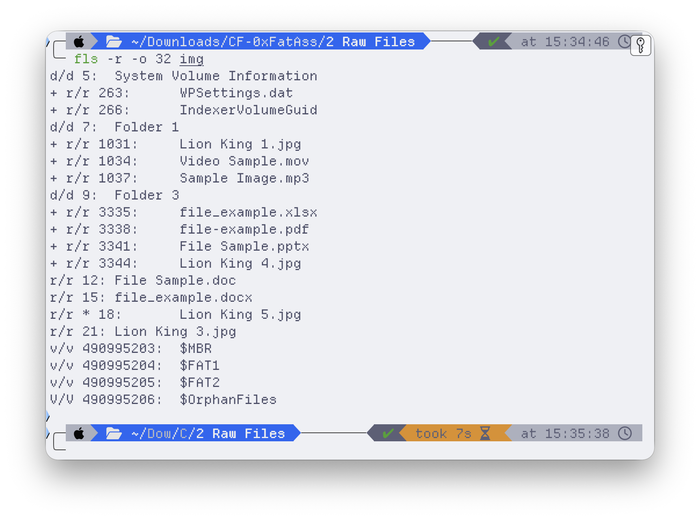
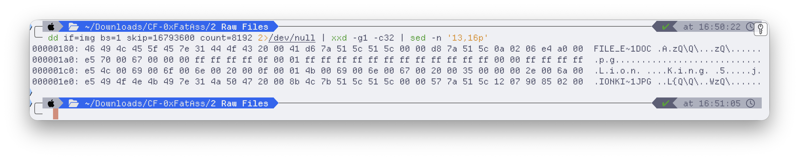
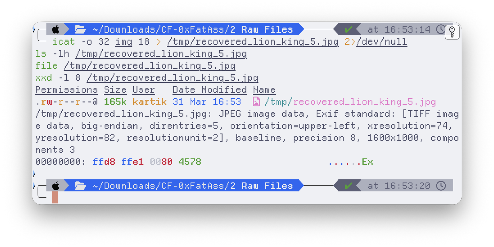
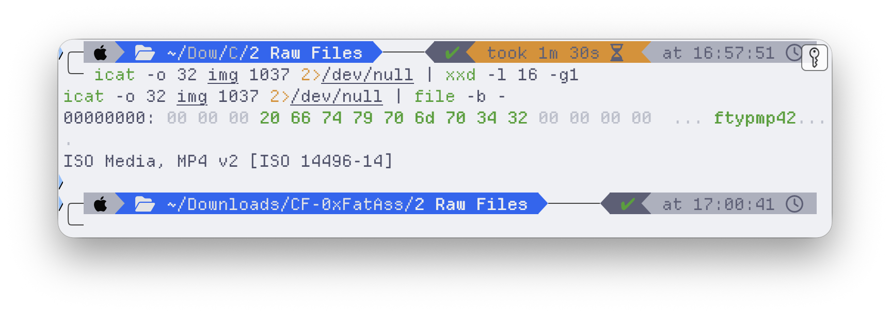
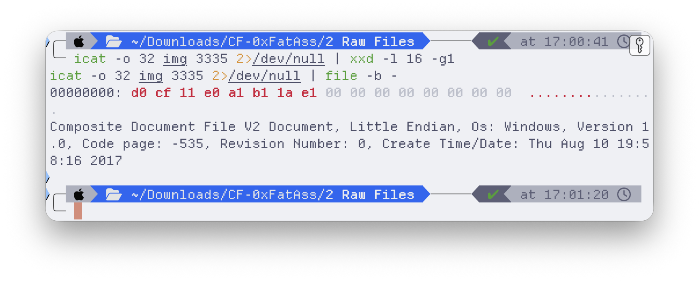
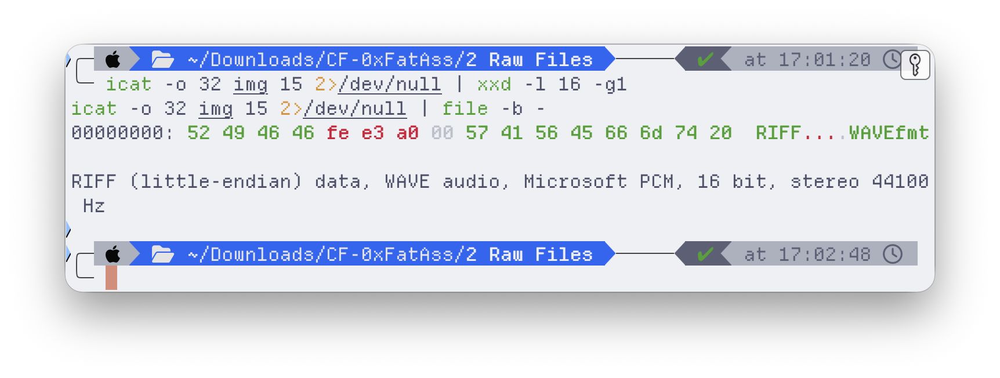
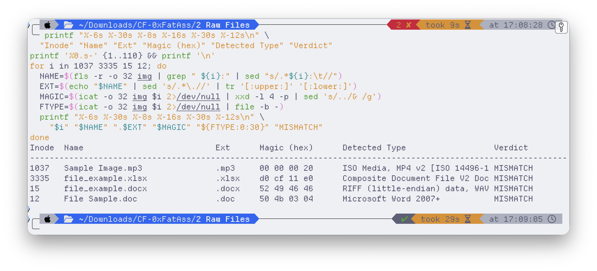
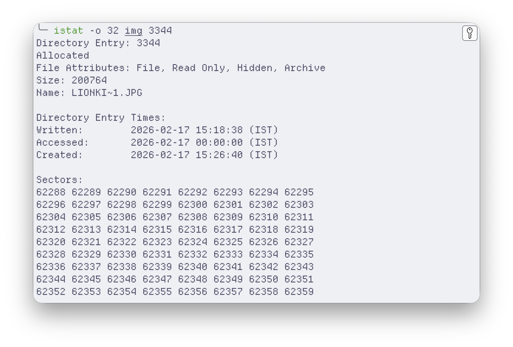

There's a difference between *recovering a file* and producing *evidence a court will accept*, and the gap between the two is an entire discipline.

In my computer-forensics coursework at NFSU, one exercise drove that home. The task wasn't "undelete the file." It was: here is a disk image — examine it, and write your findings as a formal examination report in the format an Indian court accepts under **Section 79A of the IT Act** and **Section 293 of the CrPC**. Letterhead, chain of custody, exhibit marking, the works. That constraint changes how you work. You can't lean on a GUI that says "6 files" if you can't explain *why* it says 6. Every number has to trace back to a byte on the disk, and anyone with the same image has to be able to reproduce it.

Here's that investigation — the recovery, the four files caught lying about what they were, and why the byte-level discipline is the whole point.

## The evidence

One exhibit: a 15 GB forensic image of a USB flash drive, FAT32 (`MD5 509dd658…`). The questions were open-ended — how many files and directories, are any hidden, are any deleted, do the file types actually match their extensions, and has anything been tampered with. No hints about what I'd find.

Everything below came from [The Sleuth Kit](https://www.sleuthkit.org/) (`fls`, `istat`, `icat`) plus `xxd` and `dd` — examined from the boot record through the FAT32 directory entries by hand.

## Ground truth, byte by byte

FAT32 stores every file and directory as one or more **32-byte directory entries**. The first byte tells you the state — `0x00` ends the directory, `0xE5` marks a deleted entry, anything else is live — and the attribute byte at offset `0x0B` separates directories (`0x10`) from files (`0x20`). Long names get extra entries (attribute `0x0F`) stacked in front of the classic 8.3 entry.

Counting straight from those entries: **3 directories, 12 active files, 1 deleted file.** And here's the first reason "court-admissible" forces byte-level work — a GUI tool like Autopsy reports **6** directories, because it counts its own virtual constructs (`$OrphanFiles`, `$CarvedFiles`, `$Unalloc`) that have no directory entry, no cluster, no existence on the physical disk. If your report says "6" because the tool said so, you lose the instant opposing counsel asks you to point to the sixth directory on the medium. The defensible answer is **3**, and you can show every one.

## The deleted file

`fls -r -d` lists only entries flagged deleted. Exactly one came back: `Lion King 5.jpg`, inode 18. Deleting a file in FAT32 doesn't erase anything — the OS just writes `0xE5` over the first byte of each directory entry and frees the cluster chain. The data sits untouched until something overwrites it.

So I dumped the raw directory cluster and read the deleted entry by hand:

Three consecutive entries, each beginning with `e5`: two Long File Name fragments and the 8.3 record. Read the LFN fragments bottom-up — `Lion King 5.j` + `pg` — and the original name reconstructs to `Lion King 5.jpg`. The 8.3 entry still holds the starting cluster (1810) and size (165,264 bytes), and the FAT showed those clusters were never reallocated.

So recovery isn't a gamble here. `icat` pulls the bytes straight from the cluster chain — and the recovered file has to *prove* it's intact, which it does, in its own header:

`FF D8 FF E1` — the JPEG Start-of-Image and Exif markers. A 165 KB file the filesystem had marked "deleted," recovered and verified as a genuine, complete image. In a report that distinction is everything: I didn't just *get a file back*, I demonstrated the recovered bytes are authentic.

## Files in disguise

This is where it got interesting. An extension is just a label a user types; the **magic bytes** at the start of a file are the truth. Checking every file's signature against its extension turned up four that were lying.

**An MP3 that's a video.** `Sample Image.mp3` should open with an MPEG frame-sync (`FF FB`) or an ID3 tag. Instead:

`…ftypmp42` — the ISO Base Media `ftyp` box. It's an MP4 video wearing an `.mp3` extension.

**A spreadsheet older than it claims.** `file_example.xlsx` should be a ZIP (`50 4B 03 04` — `.xlsx` is zipped XML). Instead it's an OLE2 compound document — the *legacy* `.xls` format — and the OLE2 header even carries an embedded creation date:

Created **August 2017**. The extension was changed to look modern; the bytes remember when the file was really made. That's a provenance tell you'd never get from a directory listing.

**A Word document that's audio.** The most blatant one — `file_example.docx`. You don't even need a tool; the ASCII column says it out loud:

`RIFF….WAVEfmt ` — a CD-quality WAV audio file renamed to `.docx`. The chunk-size field even matches the on-disk file size exactly, proving it's complete and untruncated, just mislabeled.

(The fourth, `File Sample.doc`, was subtler: a modern `.docx` — ZIP/`PK` — stored under the legacy `.doc` extension. Wrong label, right family.)

## The quiet tell

One more, easy to miss. `Lion King 4.jpg`'s metadata showed a **Written** time *earlier* than its **Created** time:

In a normal "create a new file" flow that's impossible — you can't modify something before it exists. What it actually means: the file was **copied** onto this volume from somewhere else, and FAT32 kept the original modification time while stamping a fresh creation time at copy. Another provenance breadcrumb, sitting in plain sight in the directory entry.

## Why "court-admissible" is the whole point

None of the individual techniques here are exotic — `fls`, a hex dump, a magic-byte check. What makes it forensics rather than tinkering is that **every claim is anchored to a byte and reproducible by anyone with the image**: 3 directories (not the tool's 6), a recovered JPEG verified by its own header, four extensions disproven by their signatures, a copied file betrayed by its timestamps. No "the tool said so."

That's the line between *I recovered a file* and *evidence that survives cross-examination* — and learning to work on the right side of it, in the report format a court actually expects, was the real exercise.
